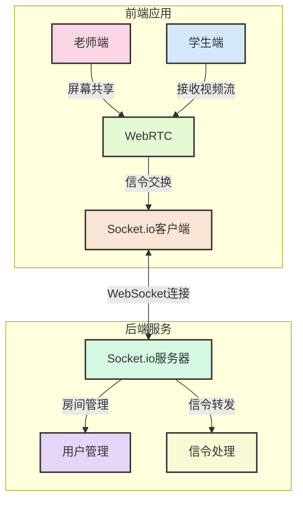
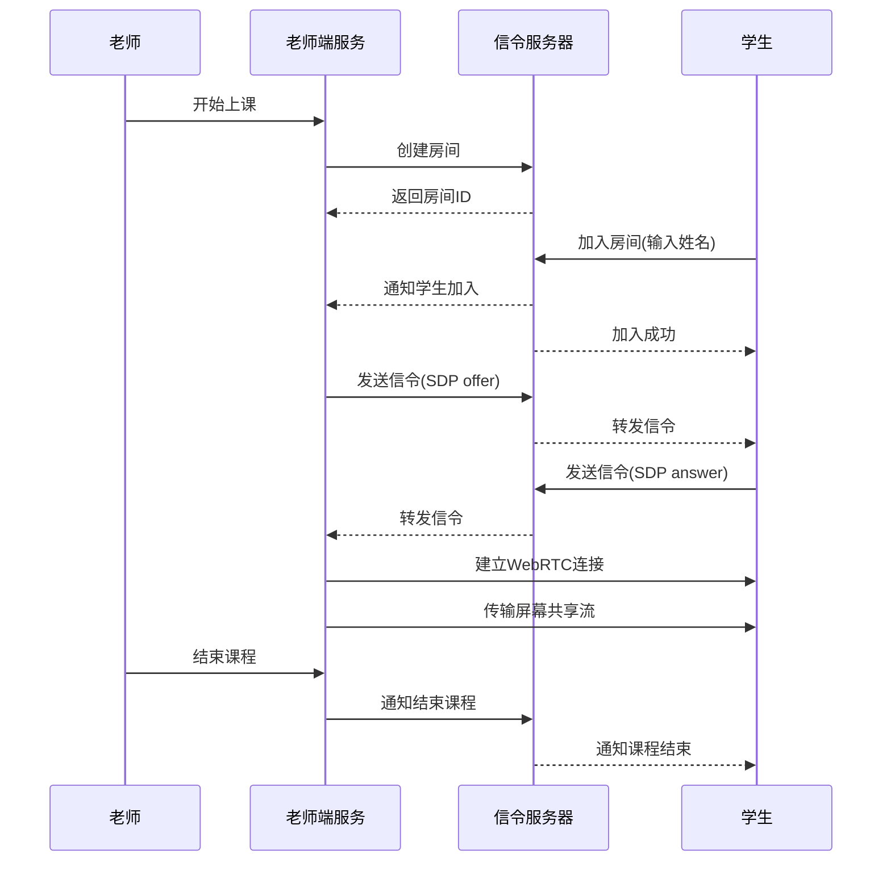

# 📺 WebRTC在线课堂系统

## 🚀 功能介绍

这是一个基于WebRTC技术的在线课堂系统，支持以下功能：

- 🖥️ 老师端屏幕共享直播
- 👀 学生端实时观看课程
- 📝 学生姓名登记与管理
- 👥 老师可查看在线学生列表
- 🚫 老师可踢出特定学生
- 🔄 课程结束与重连机制

## 🔗 源码地址

 [源码地址](https://gitee.com/szxio/online-classroom)

## 📸 系统截图展示


### 📊 老师端界面


### 📱 学生登录界面


### 👨‍🏫 学生上课界面


### 👨‍🎓 老师管理学生


### 👥 被移除课堂提示


### 🚫 课程结束提示


## 🔧 环境依赖

- 📦 Node.js >= 18.0.0（推荐使用 18.x 或 20.x 版本）

## 💻 技术栈

### 🌐 前端
- ⚡ Vue 3.5.x - 前端框架
- 🛠️ Vite 5.x - 构建工具
- 🎨 Element Plus - UI组件库
- 🔌 Socket.io-client - WebSocket客户端
- 📡 Simple-peer 9.10.0 - WebRTC封装库
- 🧭 Vue Router - 路由管理
- 🧩 Node.js polyfills（buffer、process、stream-browserify、util、events、assert）- 浏览器兼容性支持

### ⚙️ 后端
- 🖧 Node.js - 运行环境
- 🚂 Express - Web服务器框架
- 📶 Socket.io - WebSocket服务器
- 🔑 UUID - 唯一ID生成

## 📊 系统架构



## 📊 项目架构

```
webrtc-classroom-demo/
├── backend/                # 后端服务
│   ├── server.js           # Socket.io 信令服务器
│   └── package.json        # 后端依赖配置
│
└── frontend/               # 前端应用
    ├── src/                # 源代码
    │   ├── views/          # 页面组件
    │   │   ├── TeacherLive.vue  # 老师直播页面
    │   │   └── StudentView.vue  # 学生观看页面
    │   ├── App.vue         # 根组件
    │   └── main.js         # 入口文件
    ├── router/             # 路由配置
    ├── public/             # 静态资源
    └── vite.config.js      # Vite 配置
```

## 🔄 工作流程



## ✨ 项目特点

- 🔥 使用 WebRTC 实现低延迟的实时屏幕共享
- 📡 基于 Socket.io 的信令服务器处理连接建立
- 🎯 简洁直观的用户界面，使用 Element Plus 组件库
- 🛡️ 完善的错误处理和重连机制
- 🔄 针对 WebRTC 在浏览器环境的特殊处理和兼容性优化

## 🚀 启动方式

### 🔄 后端服务启动

```bash
cd backend
npm install
npm start
```

服务将在 http://localhost:3000 启动

### 🌐 前端服务启动

```bash
cd frontend
npm install
npm run dev
```

前端开发服务将在 http://localhost:5173 启动

## 📚 使用方式

1. 🏠 访问 http://localhost:5173 进入老师端界面
2. ▶️ 点击"开始上课"按钮，允许屏幕共享
3. 📋 复制生成的学生链接
4. 👨‍🎓 学生通过该链接进入课堂，输入姓名后即可观看直播
5. 👮‍♂️ 老师可在右侧面板查看和管理在线学生

## ⚠️ 注意事项

- 🌐 确保浏览器支持WebRTC（推荐使用Chrome、Edge或Firefox最新版本）
- 🔒 部署到线上后，必须使用HTTPS协议才能进行屏幕共享（localhost可忽略）